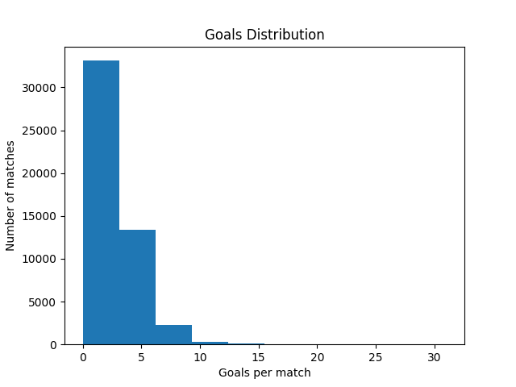
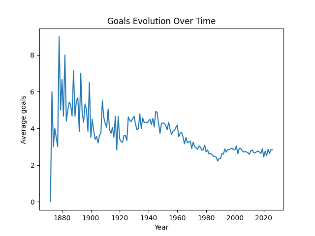
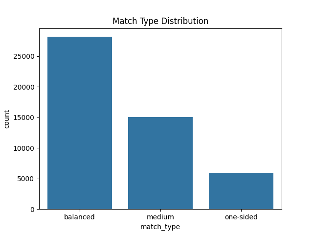

# ⚽ Football Match Analysis: Insights from 50,000+ Games

## 📊 Project Overview

This project analyzes international football matches using Python, focusing on scoring patterns, match balance, and team performance over time.

The goal is to extract meaningful insights from historical data and understand how football evolved as a sport.

Dataset source: Kaggle (International football results dataset)

---

## 🎯 Objectives

* Analyze goal distribution in football matches
* Identify home advantage
* Detect high-scoring matches
* Study match balance (close vs one-sided games)
* Define and analyze "exciting" matches
* Compare team performance and dominance
* Explore evolution of teams over time

---

## 🛠️ Technologies Used

* Python
* pandas
* matplotlib
* seaborn

---

## 📈 Key Insights

### ⚽ Goal Distribution

* Most matches have between 0–5 goals
* High-scoring matches (>3 goals) represent only ~30% of total matches

---

### 📉 Evolution of Football

* The average number of goals per match has slightly decreased over time
* Modern football tends to be more tactical and controlled

---

### 🏠 Home Advantage

* Home teams win more frequently than away teams
* Confirms well-known football patterns

---

### ⚖️ Match Balance

* Most matches are decided by small goal differences (0–1 goals)
* Football is generally a balanced, low-scoring sport

---

### 🔥 "Exciting" Matches

* Defined as matches with:

  * at least 3 goals
  * and a goal difference ≤ 1
* Only ~30% of matches fall into this category
* Truly exciting matches are relatively rare

---

### 🌍 Team Analysis

* Strong teams tend to dominate rather than produce "exciting" matches
* Mid-level teams produce more balanced and high-scoring games

---

### 📊 Team Evolution (Case Study: Brazil)

* The Brazil national football team shows a relatively constant goal-scoring trend over time
* Variations can be explained by:

  * historical context (e.g. fewer matches in certain periods)
  * generational changes in players
  * evolution of playing styles

---

## 📷 Visualizations

### Goal Distribution



### Goals Over Time



### Match Types



---

## ▶️ How to Run

1. Download the dataset from Kaggle
2. Place `results.csv` in the project folder
3. Run the script:

```bash
python main.py
```

---

## 📂 Dataset

The dataset is not included due to size.
You can download it from Kaggle:
https://www.kaggle.com/datasets/martj42/international-football-results-from-1872-to-2017

---

## 🚀 Future Improvements

* Add advanced metrics (e.g. expected goals - xG)
* Include player-level data
* Build an interactive dashboard (Streamlit / Plotly)

---

## 📌 Conclusion

Football matches are generally balanced and low-scoring.
The most exciting matches tend to occur between teams of similar strength rather than dominant teams.

---

## 👨‍💻 Author

Project developed as part of a learning journey in data analysis and Python.
